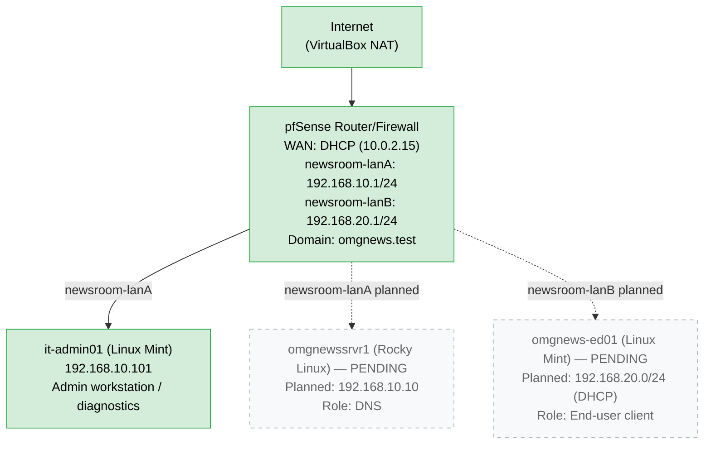

# Lab02: Reconfiguring the network

## Background and objective
My initial goal in this lab was to add the rest of the machines to the *Old Millington Gazette* network but I immediately hit RAM bandwidth issues on my 16GB Windows 11 host. I was forced to rethink my network topography to reduce the number of nodes and find lightweight solutions for key network services. So my new goal became configuring a pfSense router for subnetting, firewall and as a DHCP and DNS server for the network. I also reconfigured my it-admin01 client into the new network structure and tested its connection to pfSense.

## Blueprint


---

## Evidence
1. Confirm interface configuration on it-admin01

```bash
itadmin01@itadmin01:~$ ip a show enp0s3
2: enp0s3: <BROADCAST, MULTICAST, UP, LOWER_UP> mtu 1500 qdisc fq_codel state UP group default qlen 1000
    link/ether 08:00:27:03:06:37 brd ff:ff:ff:ff:ff:ff
    inet 192.168.10.101/24 brd 192.168.10.255 scope global noprefixroute enp0s3 valid lft forever preferred_lft forever
    inet6 fe80:8863:lf7:ae70:69f1/64 scope link noprefixroute valid lft forever preferred_lft forever
```

2. Confirm default route using **ip route**

```bash
itadmin01@itadmin01:~$ ip route
default via 192.168.10.1 dev enp0s3 proto static metric 100
192.168.10.0/24 dev enp0s3 proto kernel scope link src 192.168.10.101 metric 100
```

3. Confirm connection to gateway by pinging to the pfSense router at 192.168.10.1

```bash
itadmin01@itadmin01:~$ ping -c 4 192.168.10.1
PING 192.168.10.1 (192.168.10.1) 56(84) bytes of data.
64 bytes from 192.168.10.1: icmp_seq=1 ttl=64 time=1.24ms
64 bytes from 192.168.10.1: icmp_seq=2 ttl=64 time=0.921ms
64 bytes from 192.168.10.1: icmp_seq=3 ttl=64 time=1.29ms
64 bytes from 192.168.10.1: icmp_seq=4 ttl=64 time=1.34ms

--- 192.168.10.1 ping statistics ---
4 packets transmitted, 4 received, 0% packet loss, time 3007ms
rtt min/avg/max/mdev = 0.921/1.196/1.338/0.162 ms
```

4. Confirm connection to the internet by pinging IP address 8.8.8.8

```bash
itadmin01@itadmin01:~$ ping -c 4 8.8.8.8
PING 8.8.8.8 (8.8.8.8) 56(84) bytes of data.
64 bytes from 8.8.8.8: icmp_seq=1 ttl=62 time=10.1ms
64 bytes from 8.8.8.8: icmp_seq=2 ttl=62 time=11.11ms
64 bytes from 8.8.8.8: icmp_seq=3 ttl=62 time=11.4ms
64 bytes from 8.8.8.8: icmp_seq=4 ttl=62 time=9.00ms

--- 8.8.8.8 ping statistics ---
4 packets transmitted, 4 received, 0% packet loss, time 3004ms
rtt min/avg/max/mdev = 8.997/10.396/11.403/0.949 ms
```

5. Confirm DNS resolution through the pfSense resolver

```bash
itadmin01@itadmin01:~$ nslookup google.com 192.168.10.1
Server:    192.168.10.1
Address:    192.168.10.1#53

Non-authoritative answer:
Name:    google.com
Address:    142.250.129.139
Name:    google.com
Address:    142.250.129.102
Name:    google.com
Address:    142.250.129.101
Name:    google.com
Address:    142.250.129.113
Name:    google.com
Address:    142.250.129.138
Name:    google.com
Address:    142.250.129.100
Name:    google.com
Address:    2a00:1450:4009:c13::64
Name:    google.com
Address:    2a00:1450:4009:c13::8a
Name:    google.com
Address:    2a00:1450:4009:c13::66
Name:    google.com
Address:    2a00:1450:4009:c13::65
```

6. Screenshots showing the pfSense interfaces and configuration


---

## Troubleshooting 

**Installer:** The Netgate Installer ISO for pfSense is a network-bootstrapping installer not a self-contained image. During installation I found myself caught in a loop back to interface assignment because the installer could not download necessary files. **Lesson:** Check ISO variant before installing. **Solution:** Ensured the pfSense VM had network adapter 1 was assigned to NAT for internet connectivity during installation.

**Diagnostic process:** I had several issues with connectivity during setup and learned to diagnose in a strict order -> interface/IP settings (ip a) -> connectivity (ping) -> routing out via NAT (ping to external IP) -> DNS resolution (nslookup) -> firewall settings (public/private which may block ICMP traffic) 
