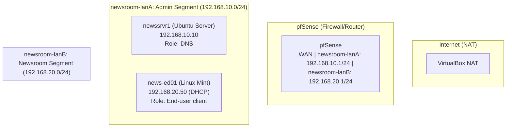

# Lab02: Reconfiguring the network

## Background and objective
My initial goal here was to add the rest of the machines to the *Old Millington Gazette* network but I immediately hit RAM bandwidth issues on my 16GB host. I was forced to rethink my network topography to reduce the number of nodes and find lightweight solutions for key network services. So my new goal became configuring a pfSense router for subnetting, firewall and as a DHCP and DNS server for the network. I also reconfigured my it-admin01 client into the new network structure and tested its connection to pfSense.

## Blueprint

---

## Evidence
to come

### Troubleshooting 
to come
