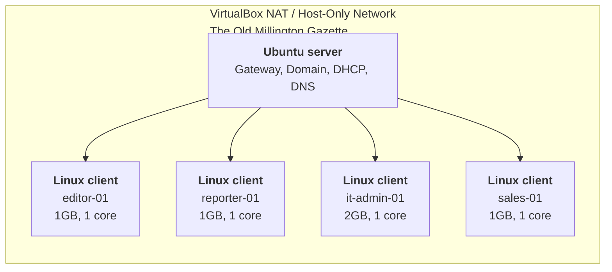

# homelab-portfolio
Welcome to the *Old Millington Gazette*.

I'm a journalist and senior lecturer retraining in IT / Cyber / AI. This repo charts my progress building a virtual newsroom network for a fictional community publisher. The news service requires editorial and sales teams on separate VLANs, all with access to a central server with shared resources, AD, DNS and DHCP. The isolated, self-contained network will be built with VMs on a GEEKOM A8 (Ryzen 7 8745HS, 16GB) using VirtualBox.

**Purpose:** This lab is part of my preparation for CompTIA Network+, Security+ and AWS Certified AI Practitioner

## Network topology blueprint v1.0

### Tools
VirtualBox, Ubuntu Server, Linux Mint, Debian

### Labs
- [x] Lab 01 - [Two nodes, static IPs - OSI Layers 1-3](https://github.com/robbaileyhome-dev/homelab-portfolio/blob/main/Labs/Lab01%20Network%20setup.md)
- [ ] Lab 02 - DHCP and DNS
- [ ] Lab 03 - Segmentation - VLANs
- [ ] Lab 04 - Directory services - authentication
- [ ] Lab 05 - File / print - shared resources
- [ ] Lab 06 - Network monitoring
- [ ] Lab 07 - Troubleshooting

### What I'm learning
- Networking: DNS, DHCP, subnetting
- Security: Domains, authentication, group policy, network monitoring
- Documentation: Break/fix troubleshooting

Connect on LinkedIn: https://www.linkedin.com/in/rob-j-bailey-/
